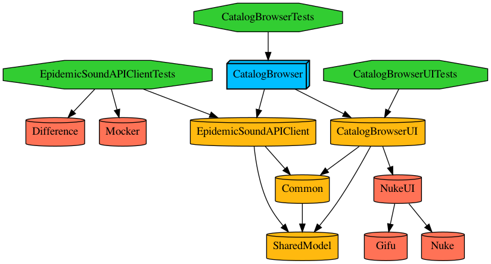

[](https://tuist.io)

# Catalog Browser 

This is an example app following the specs defined on this [guideline](https://github.com/epidemicsound/Mobile-Engineering-Coding-Interview) for Epidemic Sound challenge.

## 🛠 How to run?

This project is using [tuist](https://github.com/tuist/tuist) to manage the xcode project generation and to help with the modularization of the project.

Before running the project we have to generate the xcode project.

### 🏗 How to generate the project?

First, be sure you have tuist installed on your environment.
The recommended way, is to run the following command:

```bash
curl -Ls https://install.tuist.io | bash
```

After successfully install tuist, you can run the following command

```bash
tuist generate
```

## How to edit the project settings?

Just use tuist with the following command

```bash
tuist edit
```

Then, change the configuration.

## Points to evolve the project

- [ ] Write more tests
- [ ] Write UI tests
- [ ] Fix previews for each views
- [ ] Use the GenreView and the MoodView when needed
- [ ] Improve the routing/navigation

## Dependencies Graph

How the project is organized/modularized

[](https://mermaid.live/edit#pako:eNqN0b0KwjAQB_BXKTdV0BfoINTWoYMi1E7G4WhOG8xHiQkipe9u1CoIVcwQQvL758Klg9pwggSOFtsm2uZMR2E853SXoUNpjgtrLmey-2g2m0dZvGwFJyXq0njN002RSUHaTX6FFvHnblUMfOTgEcjjzChl9MC-Fh3D3-5cd2t_oqrof7MyLhu0xFehM_Kv-mOJ95tGBExBkVUoeOh8d_cMXEOKGCRhyemAXjoGTPeB-pajoyUXzlhIDijPNAX0zpRXXUPirKcXygWGj1SD6m9D6Jow)


## Generate Dependencies Graph?

You can use tuist to generate a graph

```bash
$ tuist graph
```

The current graph

